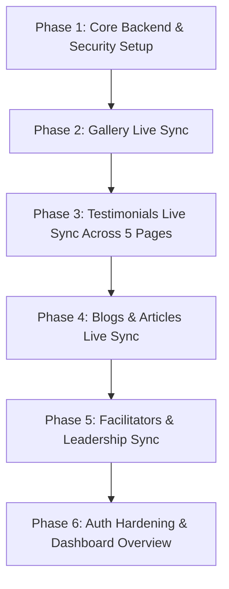

# 📋 Vijigishu Admin & Hostinger Backend Implementation Plan

> **Document Name:** `admin-implementation.md`  
> **Date:** September 5, 2026  
> **Target Environment:** Hostinger Web Hosting (PHP 8.x / Native SSD File Storage)  
> **Objective:** Transition all Vijigishu Admin Modules from browser-isolated `localStorage` to a centralized, real-time server-side backend with persistent media storage, multi-page live sync (including all academic discipline pages), and strict zero-disruption safeguards.

---

## 1. 🛡️ Core Safety Guarantees & Zero-Disruption Policy

Before any implementation, the following foundational safeguards are strictly established:

1. **Documentation & Content Integrity:**
   - No itinerary text, bullet points, inclusions, titles, meta tags, or custom stylings across any pages will be touched or altered.
   - No shortcodes, component IDs, or layout classes will be renamed or disrupted.
2. **Progressive Enhancement & Offline Resilience:**
   - Every public-facing page (`index.html`, `gallery.html`, `management.html`, `engineering.html`, `architecture-design.html`, `school-programs.html`, `about.html`) retains its existing inline preset fallback.
   - If the server or API is ever undergoing maintenance or temporarily unreachable, the frontend pages seamlessly display their default content without throwing errors or breaking UI rendering.
3. **Subfolder Path Normalization:**
   - Media paths returned by the API (e.g. `/uploads/testimonials/...`) are automatically handled and normalized so they render perfectly on root pages (`index.html`) and subfolder pages (`our-programs/*.html`) alike.

---

## 2. 🏗️ Architecture & System Design

```
                               ┌────────────────────────────────────────────────────────┐
                               │                Hostinger Web Hosting                   │
                               │                                                        │
                               │   📁 /data/ (Protected via .htaccess)                  │
                               │   ├── config.php (Hashed admin credentials & salt)     │
                               │   ├── gallery.json                                     │
                               │   ├── testimonials.json                                │
                               │   ├── blogs.json                                       │
┌───────────────────────────┐  │   └── facilitators.json                                │  ┌───────────────────────────┐
│     Admin Interfaces      │  │                                                        │  │     Public Web Pages      │
│  • admin-gallery.html     │  │   📁 /uploads/ (Public Media Storage)                  │  │  • gallery.html           │
│  • admin-testimonials.html│  │   ├── /gallery/                                        │  │  • index.html (Home Testi)│
│  • admin-blog.html        │──┼──►├── /testimonials/                                  ├──┼─►• management.html (Testi)│
│  • admin-facilitators.html │  │   ├── /blogs/                                          │  │  • engineering.html(Testi)│
│  • login.html             │  │   └── /team/                                           │  │  • architecture.html(Testi│
└───────────────────────────┘  │                                                        │  │  • school-programs.html   │
                               │   ⚙️ /api/ (RESTful PHP Endpoints)                     │  │  • about.html (Team/Bios) │
                               │   ├── auth.php (Login, logout, session verification)   │  │  • blog pages             │
                               │   ├── upload.php (Secure file handler & sanitization)  │  └───────────────────────────┘
                               │   ├── gallery.php (CRUD for gallery items)             │
                               │   ├── testimonials.php (CRUD for reviews)              │
                               │   ├── blog.php (CRUD for blog posts)                   │
                               │   └── facilitators.php (CRUD for leadership/team)      │
                               └────────────────────────────────────────────────────────┘
```

---

## 3. 🗄️ Server Data Models & Schemas

### A. `/data/gallery.json`
```json
[
  {
    "id": "gal_1725540000",
    "src": "uploads/gallery/singapore-marina-bay.webp",
    "country": "singapore",
    "label": "Singapore",
    "title": "Vijigishu Immersion Program - Singapore",
    "createdAt": 1725540000
  }
]
```

### B. `/data/testimonials.json`
```json
[
  {
    "id": "testi_1725540001",
    "name": "Dr. Vijaya Kumar Thota",
    "role": "Faculty",
    "stars": 5,
    "img": "uploads/testimonials/dr-vijaya-kumar.webp",
    "text": "The international immersion program curated by Vijigishu provided an unparalleled academic exposure...",
    "category": "all",
    "createdAt": 1725540001
  }
]
```

### C. `/data/blogs.json`
```json
[
  {
    "id": "blog_1725540002",
    "slug": "future-of-global-academic-travel",
    "title": "The Future of Global Academic Travel for Indian Universities",
    "category": "Education",
    "author": "Vijigishu Editorial",
    "date": "September 2026",
    "coverImg": "uploads/blogs/future-travel.webp",
    "excerpt": "How experiential learning abroad bridges the industry-academia gap.",
    "content": "<p>Full HTML content...</p>",
    "status": "published",
    "createdAt": 1725540002
  }
]
```

### D. `/data/facilitators.json`
```json
[
  {
    "id": "facil_1725540003",
    "name": "Neeraj Yadav",
    "designation": "Director",
    "bio": "After serving in the industry for 15+ years of heading senior positions and delivering success...",
    "img": "uploads/team/neeraj-yadav.webp",
    "linkedin": "https://linkedin.com",
    "createdAt": 1725540003
  }
]
```

---

## 4. 🔌 API Specification & Multi-Page Sync Mapping

### `1. /api/auth.php`
- `POST ?action=login`: Validates credentials (`email` + `password`). Returns secure session / token.
- `GET ?action=verify`: Checks if current session/token is valid.
- `POST ?action=logout`: Clears session/token.

### `2. /api/upload.php`
- `POST`: Expects `multipart/form-data` with `file` and `folder` (`gallery`, `testimonials`, `blogs`, `team`).
- Validates allowed extensions (`.webp`, `.jpg`, `.jpeg`, `.png`, `.svg`) and file size (max 5MB).
- Sanitizes file names and returns `{ "success": true, "url": "uploads/gallery/img-123.webp" }`.

### `3. /api/gallery.php`
- `GET`: Returns JSON array of all active gallery items (`Cache-Control: max-age=60`).
- `POST`: Adds a new gallery item (Requires Admin Auth).
- `DELETE ?id={id}`: Deletes record from `gallery.json` **and physically removes file from disk** (Requires Admin Auth).
- **Public Target:** `gallery.html`.

### `4. /api/testimonials.php`
- `GET`: Returns JSON array of live testimonials (publicly accessible).
- `POST`: Creates new testimonial with reviewer photo, name, role (Faculty/Student), star rating, and review text.
- `PUT`: Edits existing testimonial.
- `DELETE ?id={id}`: Deletes testimonial and associated uploaded photo.
- **Multi-Page Public Live-Sync Targets:**
  1. 🏠 **Homepage (`index.html`):** Main interactive testimonial grid/slider.
  2. 💼 **Management Program (`our-programs/management.html`):** Testimonial slider.
  3. ⚙️ **Engineering Program (`our-programs/engineering.html`):** Testimonial slider.
  4. 📐 **Architecture & Design Program (`our-programs/architecture-design.html`):** Testimonial slider.
  5. 🎒 **School Immersion Program (`our-programs/school-programs.html`):** Testimonial slider.

### `5. /api/blog.php`
- `GET`: Returns published blogs (or single blog by `?slug={slug}`).
- `POST`: Creates/saves blog draft or publishes post (Requires Admin Auth).
- `DELETE ?id={id}`: Deletes blog post and associated media (Requires Admin Auth).
- **Public Target:** Blog index & article template pages.

### `6. /api/facilitators.php`
- `GET`: Returns active team members/facilitators.
- `POST` / `PUT` / `DELETE`: Manages team profiles (Requires Admin Auth).
- **Public Target:** `about.html` (Directors & Team bios).

---

## 5. 🛡️ Security & Directory Protection

### A. Protecting the `/data/` Directory
```apache
# /data/.htaccess
Require all denied
```

### B. Securing File Uploads (`/uploads/`)
```apache
# /uploads/.htaccess
<FilesMatch "\.(php|phtml|php3|php4|php5|php7|phps|cgi|pl|exe|sh)$">
    Require all denied
</FilesMatch>
Options -ExecCGI
```

### C. Admin API Authentication Middleware
Every modifying request (`POST`, `PUT`, `DELETE`) passes through a central `checkAuth()` helper in PHP verifying the session / bearer token before any write operation is performed.

---

## 6. 📅 Phased Implementation Roadmap



### Phase 1: Core Backend & Security Setup
- [ ] Create `/api/` helper classes: `Response.php`, `Auth.php`, `Storage.php`.
- [ ] Create `/data/` directory with initial seed data and `.htaccess` protection.
- [ ] Create `/uploads/` directory structure with script-execution blocking `.htaccess`.
- [ ] Create `/api/upload.php` file handler.

### Phase 2: Gallery Live Sync (`admin-gallery.html` ↔ `gallery.html`)
- [ ] Implement `/api/gallery.php` (GET, POST, DELETE with physical file cleanup).
- [ ] Update `admin-gallery.html` to upload directly via `/api/upload.php` and persist via `/api/gallery.php`.
- [ ] Update `gallery.html` to fetch dynamic list from `/api/gallery.php` with fallback resilience.

### Phase 3: Testimonials Live Sync (`admin-testimonials.html` ↔ 5 Live Pages)
- [ ] Implement `/api/testimonials.php`.
- [ ] Update `admin-testimonials.html` with direct photo upload and live saving.
- [ ] Connect and verify live sync across all 5 public pages:
  - `index.html` (Homepage)
  - `our-programs/management.html`
  - `our-programs/engineering.html`
  - `our-programs/architecture-design.html`
  - `our-programs/school-programs.html`

### Phase 4: Blogs & Articles Live Sync (`admin-blog.html` ↔ Blog Pages)
- [ ] Implement `/api/blog.php`.
- [ ] Update `admin-blog.html` to save articles, publish status, and cover images to Hostinger storage.

### Phase 5: Facilitators & Team Live Sync (`admin-facilitators.html` ↔ `about.html`)
- [ ] Implement `/api/facilitators.php`.
- [ ] Connect `admin-facilitators.html` and `about.html` leadership section.

### Phase 6: Authentication & Dashboard Overview
- [ ] Implement secure `/api/auth.php` password hashing (`password_hash` with Argon2id / BCRYPT).
- [ ] Connect `login.html` and `admin-dashboard.html` metrics counter (real total counts of images, reviews, blogs).

---

## 7. 🧪 Multi-Page Verification & Testing Checklist

1. **Academic Testimonials Live-Sync Check:** Add/edit a testimonial in `admin-testimonials.html` → verify it updates simultaneously across:
   - `index.html`
   - `our-programs/management.html`
   - `our-programs/engineering.html`
   - `our-programs/architecture-design.html`
   - `our-programs/school-programs.html`
2. **Subfolder Relative Path Integrity:** Verify all image URLs resolve without 404 errors regardless of whether loaded from `/` or `/our-programs/`.
3. **Upload & Render Test:** Upload a new test image in `admin-gallery.html` → verify it immediately appears on `gallery.html` in an Incognito window.
4. **Clean Delete Test:** Delete the test image in `admin-gallery.html` → verify the record is removed from `data/gallery.json` **and** the file is physically deleted from `/uploads/gallery/`.
5. **Zero-Disruption Assurance:** Run page comparison diffs to ensure no layout, itinerary text, or shortcode has been altered.
